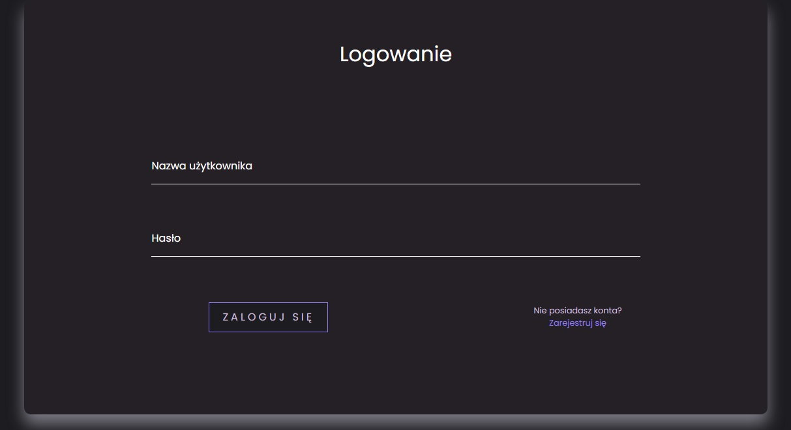
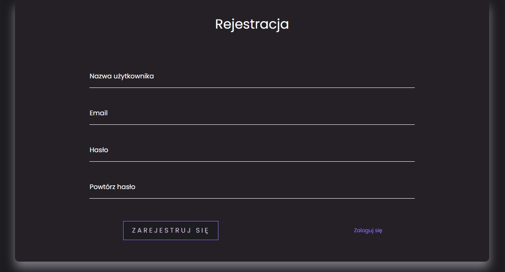
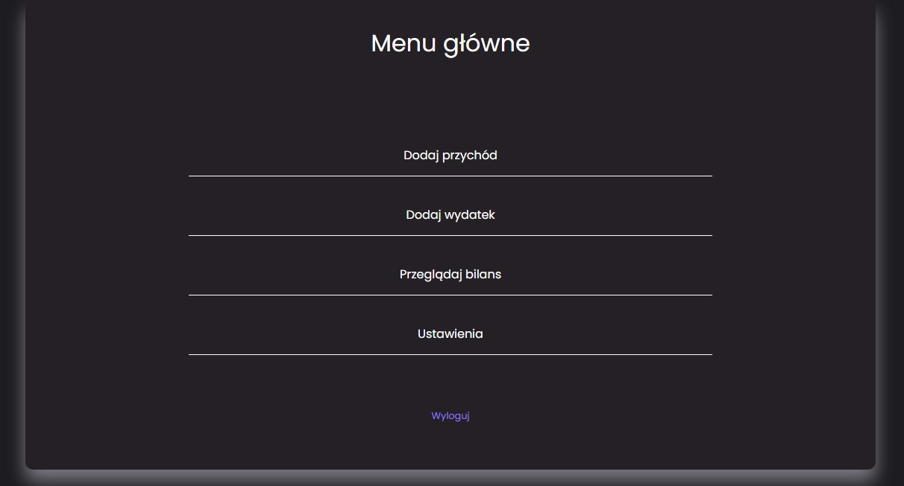
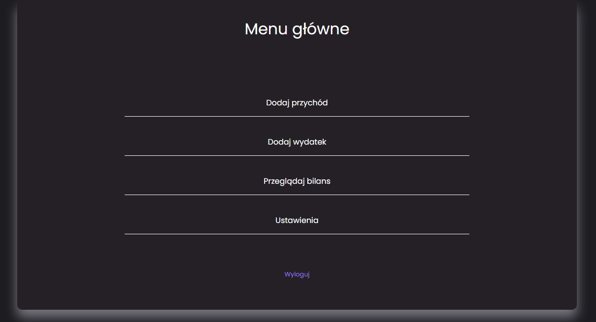
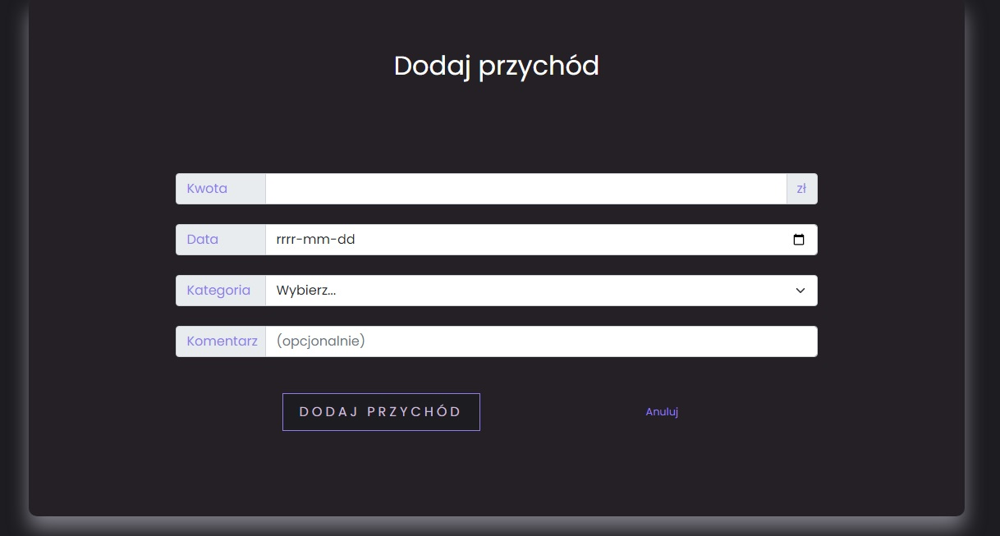
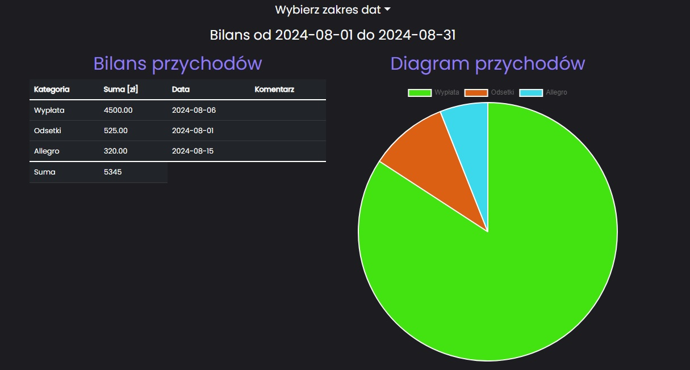
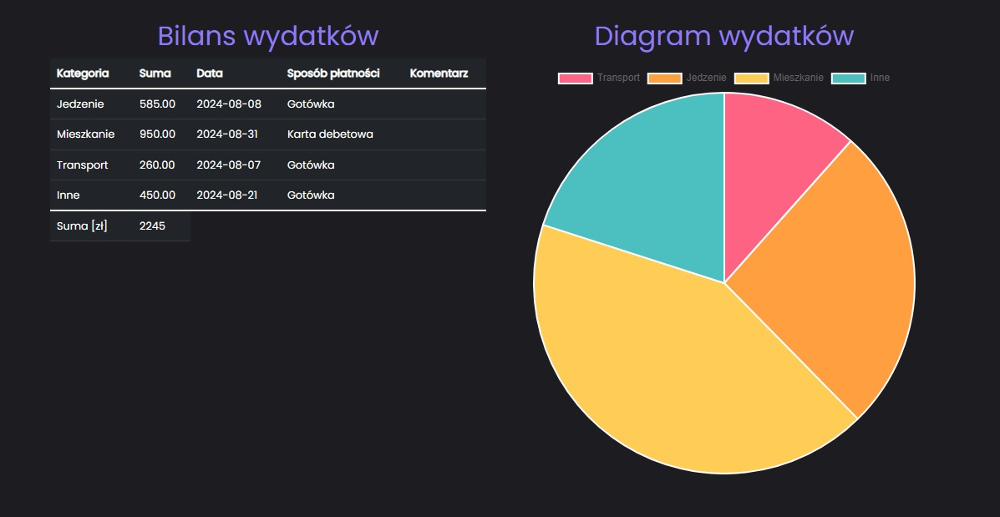

# Budget_App_Web_Bootstrap

 

 

## :scroll: Project description

Responsive household budgeting application written using PHP and BOOTSTRAP.
The programme initially asks the user to log in or create an account.
The form validator is responsible for the correctness of the login and registration.
Once the account has been created/logged in correctly, the user is taken to the main menu of the programme. 
The main menu has 4 options to choose from: "add income", "add expense", "view balance sheet", "settings" and a "logout" button.
The first option "add income" allows the user to add the amount of income, the date of that income, its category and an optional comment.
The second option 'add expense' allows the user to add the amount of the expense, the date of this income, the method of payment, the category and an optional comment. 
The "view balance sheet" option provides us with a summary of our expenditure and income in the form of a diagram. We can also easily select the period of interest, e.g. the previous month or the current year. 

https://budget.pawel-burakowski.profesjonalnyprogramista.pl/

## :hammer_and_pick: Built With

- PHP
- HTML
- CSS

 

 